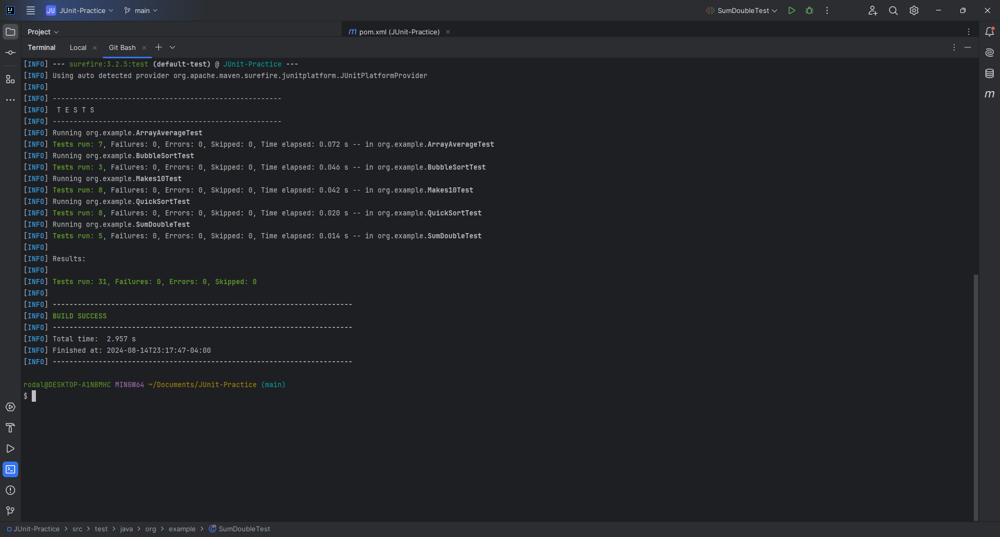

# JUnit-Practice Project

## Overview
This project applies JUnit testing to 5+ Java practice problems, demonstrating unit testing skills.

## Structure
- `src/main/java/org/example/`: Main Java classes
- `src/test/java/org/example/`: JUnit test classes
- `test_results.png`: Screenshot of successful test runs

## Features
- Multiple Java programming challenges with JUnit tests
- Proper package structure
- Visual proof of test execution

## Running the Project
1. Clone the repository
2. Open in a Java IDE
3. Run test classes in `src/test/java/org/example/`

## Test Results

## Note
This educational project showcases JUnit testing application to Java programming challenges.

